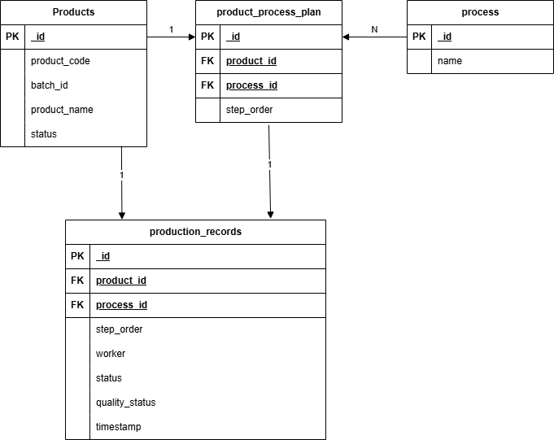
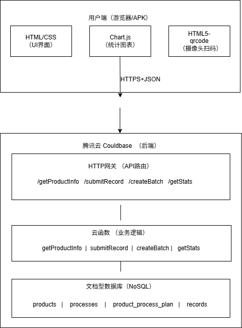
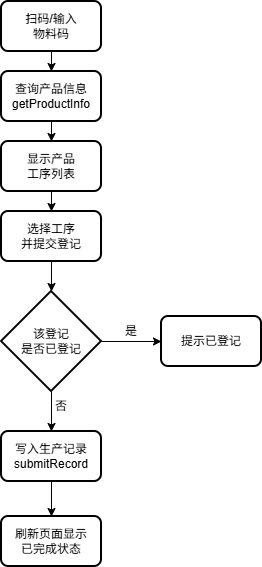
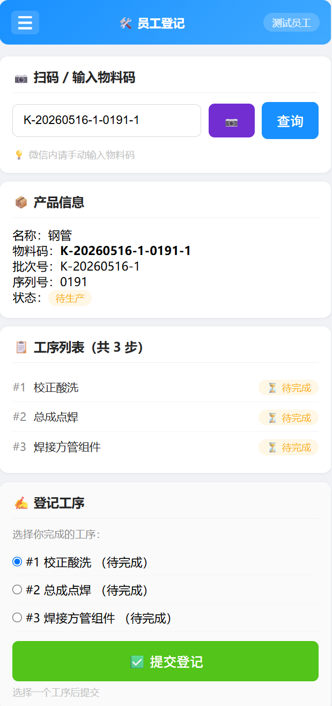

# traceability-system

> Workshop Traceability System - One-item-one-code traceability system built on Tencent Cloud CloudBase + Vanilla JavaScript

**English** | [中文](#中文版)

---

## English Version

### Workshop One-Item-One-Code Traceability System

> A full-stack product traceability system for manufacturing workshops. Supports QR code scanning, process registration, quality marking, data statistics, and export.

**Live Demo**: [https://hajimio-d6g6tsg1e608005d5-1448886989.tcloudbaseapp.com/index.html](https://hajimio-d6g6tsg1e608005d5-1448886989.tcloudbaseapp.com/index.html)

---

### 📌 Project Background

This project is designed for a manufacturing workshop to solve product traceability issues during production. It implements "one-item-one-code" — each product has a unique QR code identifier. Every operation from process registration to quality marking can be traced back to the operator, time, and result.

### 🧰 Tech Stack

| Layer | Technology |
|-------|------------|
| Frontend | Vanilla JavaScript + HTML5 + CSS3 |
| QR Scanning | html5-qrcode |
| Charts | Chart.js |
| Data Export | SheetJS (xlsx) |
| Backend | Tencent Cloud CloudBase (Cloud Functions + NoSQL DB) |
| PWA | manifest.json |
| APK Packaging | HBuilderX |

### 📐 System Design

#### Database ER Diagram

> Products and processes are linked through "process plans". Production records are stored independently, forming a complete traceability chain.

#### System Architecture

> The frontend calls cloud functions via HTTPS, which then operate on the database. Frontend and backend are fully separated, with PWA offline support.

#### Core Business Flow

> Complete user journey from scanning to registration.

### 📸 Feature Preview

| Feature | Screenshot |
|---------|------------|
| Employee Registration |  |
| Statistics & Charts |  |
| QR Code Generation |  |

### Key Features

- ✅ QR code scanning (camera + manual input)
- ✅ Process registration (single + batch mode)
- ✅ Defect marking (mark/unmark, affects pass rate)
- ✅ Employee statistics (table + bar charts)
- ✅ Product completion statistics
- ✅ Batch management (manual + Excel import)
- ✅ QR code label generation (batch export as images)
- ✅ Process management (CRUD)
- ✅ Data management (clear test data)
- ✅ PWA installation (add to home screen)
- ✅ Step-by-step wizard (worker/admin dual mode)

### 🗂️ Project Structure

├── index.html # Main page (all styles + business logic)
├── manifest.json # PWA configuration
└── README.md # Project documentation

### 📦 Database Schema

| Collection | Description |
|------------|-------------|
| `products` | Product instances (material code, batch ID, serial number) |
| `processes` | Process dictionary |
| `product_process_plan` | Process plans |
| `production_records` | Production records |

### 🔧 How to Run

1. Open `index.html` in any static server
2. Configure Tencent Cloud CloudBase environment (`API_BASE`)
3. Deploy cloud functions (see `cloudfunctions/` directory)

### 📲 Installation

- Mobile browser → click "Add to Home Screen" (PWA)
- Or package as Android APK using HBuilderX

---

### 👤 About Me

Computer Science student, full-stack developer

- GitHub: [Tommy-Wang-zx](https://github.com/Tommy-Wang-zx)
- Email: mosilian6@gmail.com
- Live Demo: [https://hajimio-d6g6tsg1e608005d5-1448886989.tcloudbaseapp.com/index.html](https://hajimio-d6g6tsg1e608005d5-1448886989.tcloudbaseapp.com/index.html)

**Project Status**: ✅ Core features complete, ready for factory trial.

---

---

## 中文版

### 车间一物一码追溯系统

> 一个面向工厂车间的产品全流程追溯系统，支持扫码登记、工序管理、质量标记、数据统计与导出。

**在线体验**：[点击查看](https://hajimio-d6g6tsg1e608005d5-1448886989.tcloudbaseapp.com/index.html)

---

### 📌 项目背景

本项目为某制造企业车间设计，用于解决产品在生产过程中的追溯问题。实现「一物一码」——每一件产品都有独立的二维码标识，从工序登记到质量标记，每一道工序的操作人员、时间、结果均可追溯。

### 🧰 技术栈

| 层级 | 技术 |
|------|------|
| 前端 | 原生 JavaScript + HTML5 + CSS3 |
| 扫码 | html5-qrcode |
| 图表 | Chart.js |
| 数据导出 | SheetJS (xlsx) |
| 后端 | 腾讯云 CloudBase (云函数 + 文档型数据库) |
| PWA | manifest.json |
| 打包 | HBuilderX (Android APK) |

### 📐 系统设计

#### 数据库设计 (ER 图)

> 说明：产品与工序通过「工序计划」关联，生产记录独立存储，形成完整追溯链。

#### 系统架构

> 说明：前端通过 HTTPS 调用云函数，云函数操作数据库。前后端完全分离，支持 PWA 离线安装。

#### 核心业务流程

> 说明：从扫码到登记完成的完整用户路径。

### 📸 功能预览

| 功能 | 截图 |
|------|------|
| 员工登记 |  |
| 统计图表 |  |
| 二维码生成 |  |

### 🚀 核心功能

- ✅ 扫码查询产品（支持手机摄像头 + 手动输入）
- ✅ 工序登记 + 批量扫码登记
- ✅ 不合格标记（标记/取消标记，影响良品率）
- ✅ 员工完成量统计（表格 + 柱状图）
- ✅ 产品完成度统计
- ✅ 批次管理（手动录入 + Excel 批量导入）
- ✅ 二维码标签生成（批量生成并导出为图片）
- ✅ 工序管理（增删改）
- ✅ 数据管理（清空测试数据）
- ✅ PWA 安装（添加到手机桌面）
- ✅ 傻瓜式操作向导（员工/管理员双模式）

### 🗂️ 项目结构
├── index.html # 主页面（含全部样式 + 业务逻辑）
├── manifest.json # PWA 配置
└── README.md # 项目说明

### 📦 数据库设计

| 集合 | 说明 |
|------|------|
| `products` | 产品实例（物料码、批次号、序列号） |
| `processes` | 工序字典 |
| `product_process_plan` | 工序计划 |
| `production_records` | 生产记录 |

### 🔧 如何运行

1. 在任意静态服务器打开 `index.html`
2. 需要配置腾讯云 CloudBase 环境（API_BASE）
3. 部署云函数（详见 `cloudfunctions/` 目录）

### 📲 安装体验

- 手机浏览器打开 → 点击「添加到主屏幕」即可安装（PWA）
- 或使用 HBuilderX 打包为 Android APK

---

### 👤 关于我

计算机科学学生，全栈开发者

- GitHub: [Tommy-Wang-zx](https://github.com/Tommy-Wang-zx)
- 邮箱: mosilian6@gmail.com
- 项目体验地址: [https://hajimio-d6g6tsg1e608005d5-1448886989.tcloudbaseapp.com/index.html](https://hajimio-d6g6tsg1e608005d5-1448886989.tcloudbaseapp.com/index.html)

**项目状态**: ✅ 已完成核心功能，已交付工厂试用
